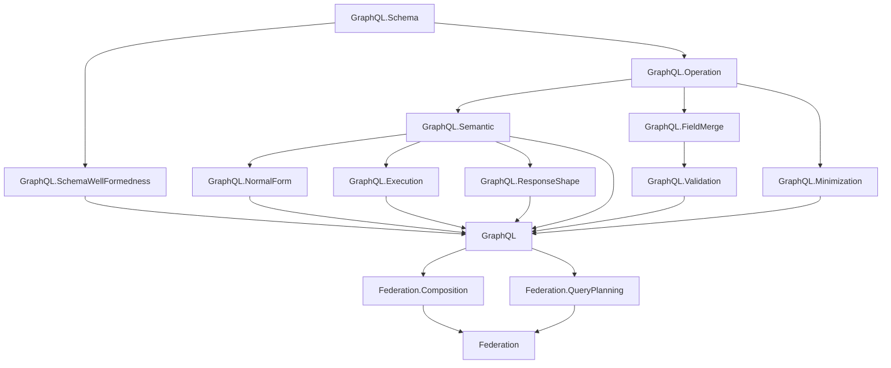

# Project Overview

`graphql-lean` is a Lean formalization workspace for GraphQL and GraphQL federation.

Part 1 models plain GraphQL. Part 2 builds on Part 1 to model federation concepts such as composition and query planning.

Canonical GraphQL specification reference: [GraphQL September 2025 Edition](https://spec.graphql.org/September2025/).

## Dependency Diagram

## Part 1: Plain GraphQL

The plain GraphQL layer is organized under the top-level `GraphQL` library root.

- `GraphQL.Schema`: shared names, type references, input values, built-in scalars, custom scalars, enums, objects, interfaces, unions, input objects, field definitions with output types, argument definitions with input types, field lookup, and possible-object inclusion for abstract types.
- `GraphQL.SchemaWellFormedness`: schema-level invariants separated from raw schema syntax, including unique type/field/argument names, root query object type, valid type references, and object/interface/union consistency.
- `GraphQL.Operation`: operation syntax, field arguments, variable definitions, built-in directive applications, selections, named fragment spreads, inline fragments, fragments, operation size, fragment-spread collection, and shared selection helpers for response names, filtering, and selection-set merging.
- `GraphQL.Semantic`: fragment-inlined operation syntax for semantic analysis. It keeps only fields and inline fragments; named fragments are inlined as inline fragments with their spread directives and fragment type conditions.
- `GraphQL.FieldMerge`: same-response-name field collection and merge compatibility, including response-shape compatibility and recursive subfield merge checks.
- `GraphQL.Validation`: validation as a proposition over a schema and operation, including variable definitions, duplicate argument checks, required argument checks, recursive input/output type checks, non-empty required selection sets, field merge checks, unique fragment names, spread resolution, acyclic fragment dependencies, and fragment applicability by possible-object overlap.
- `GraphQL.NormalForm`: ground-typed normal form and non-redundancy predicates over semantic selection sets, plus a bounded normalization pass for field merging and abstract-type grounding.
- `GraphQL.ResponseShape`: a semantic selection-set summary between raw operation syntax and ground-type normal form. It records response names, conditional field variants, child shapes, condition overlap/subset/contradiction utilities, shape inclusion, and shape equivalence.
- `GraphQL.Execution`: execution over semantic selections as a function parameterized by abstract resolver functions. It collects executable fields by response name, resolves each response name once, passes field arguments to resolvers, and applies `@skip` / `@include` filtering for fields and inline fragments.
- `GraphQL.Minimization`: finite-candidate operation minimization parameterized by an explicit operation-equivalence predicate, plus the generic minimality theorem.

### Plain GraphQL Flow

The current Part 1 flow is:

1. `GraphQL.Schema` and `GraphQL.Operation` define raw syntax.
2. `GraphQL.Semantic` inlines named fragments into a field/inline-fragment-only selection tree for semantic analysis.
3. `GraphQL.SchemaWellFormedness`, `GraphQL.FieldMerge`, and `GraphQL.Validation` state well-formedness and operation validity.
4. `GraphQL.ResponseShape` summarizes semantic selection sets as unnormalized conditional response-name variants.
5. `GraphQL.Execution` gives bounded execution over semantic selections by first collecting fields by response name, then resolving each response name once.
6. `GraphQL.NormalForm` and `GraphQL.Minimization` provide the normalization/minimization proof scaffolding.

Normalization consumes the fragment-inlined semantic form and clears retained fragment definitions from the normalized raw operation. Inline fragments without type conditions are flattened only when they have no directives; directive-bearing inline fragments are retained so their runtime condition is preserved.

The raw-to-semantic inlining step is currently treated as syntax preparation. A later theorem relating raw-operation normal forms to fragment-inlined normal forms is possible, but not required for the current semantic model.

Validation assumptions should be used when proving semantic facts about later stages. Raw syntax remains permissive; validation supplies the invariants that later proofs should rely on.

### Response Shape Model

Response shapes summarize selection sets as a list of response-name entries. A response name is the key on the output object, and each response name maps to one or more conditional variants. A variant records:

- the selected field definition, modeled as `fieldName` plus arguments,
- a type condition, modeled as an optional set/list of possible object types,
- a boolean condition, modeled as a conjunction of boolean variable literals `v` or `not v`,
- the child response shape for that variant.

The empty selection set is represented by `Shape.empty`; leaf fields use that empty child shape.

Variants under a response name are interpreted disjunctively and are not normalized. Their conditions may overlap, and both variants may be true. For example, a response name may contain `field(arg: 1)` on `{T}` with child `{a}` and another `field(arg: 1)` on `{T, U}` with child `{b}`.

This intentionally ignores concrete scalar values, object identities, list/null completion, resolver internals, and error propagation. It is a structural selection-set summary, not a full response-value model and not a definition of operation equivalence.

`GraphQL.ResponseShape` provides two views of inclusion:

- propositional inclusion, `Shape.includes required available`
- computable inclusion, `Shape.includesBool required available`

The module proves soundness and completeness bridges between those two forms. Equivalence is inclusion in both directions, again with both propositional and boolean APIs.

Variant inclusion is condition-aware: a required variant can be covered by an available variant with the same selected field when the required runtime condition is a subset of the available runtime condition.

Shape merging is also structural. Shapes merge by response name; variants under the same response name merge only when their type condition, boolean condition, and selected field definition match. This is intentionally weaker than normal-form construction because overlapping variants are preserved instead of normalized away.

Response-shape equivalence is weaker than operation equivalence. Operation equivalence should be determined through normal forms or a separate semantic equivalence theorem. Shape equivalence can be used as a supporting invariant, but it is not sufficient by itself.

The condition utility layer supports the next canonicalization step:

- type-condition subset and overlap over optional possible-type sets,
- boolean-literal contradiction detection,
- boolean-condition implication by literal containment,
- condition satisfiability, overlap, subset, and checked intersection.
- variant overlap, selected-field agreement, and per-response-name pairwise compatibility checks.
- recursive shape well-formedness, which requires those per-response-name compatibility checks at every child shape.
- response-name uniqueness for shapes, so each response name owns one variant list even when variants are not normalized.
- propositional compatibility and well-formedness predicates with soundness/completeness bridges to the boolean checks.
- response-shape construction collects selections into response-name groups and prunes unsatisfiable directive/type-condition branches.

### Shape And Normal Form

`GraphQL.ResponseShape` is an intermediate summary of a selection set. It is closer to operation syntax than ground-type normal form: it records response-name variants with type and boolean conditions, but it does not split or normalize overlapping conditions.

Operation equivalence should be determined by normal forms or a separate semantic equivalence theorem. Shape equivalence is useful as a supporting invariant and as a staging point for minimization, but it is not sufficient by itself.

### Minimization Plan

The intended minimization proof split is:

The pieces already in place are:

- response-shape inclusion and equivalence, with boolean/propositional bridges,
- a generic finite minimizer theorem over any finite list of candidates equivalent under an explicit operation-equivalence predicate.

The remaining proof ladder is:

1. Make normal forms canonical enough to decide operation equivalence up to fragment-name alpha-renaming.
2. Prove normalization preserves execution semantics and response shape as a supporting invariant.
3. Define a finite candidate generator for fragment-introducing rewrites of a fragment-free operation.
4. Prove generator soundness: every generated operation has the same normal-form semantics as the input.
5. Prove generator completeness for the chosen normal form, modulo fragment-name alpha-renaming and the operation size metric.
6. Instantiate the generic finite minimizer theorem with that candidate generator.

The normal-form work is the bridge to this proof. Fragment minimization should operate over normalized or canonicalized selection sets so equivalence is tractable.

## Part 2: Federation

Federation starts as a separate top-level Lean library root.

- `Federation.Composition`: composition rules for directives and composite schema constraints.
- `Federation.QueryPlanning`: query planning as constraint solving.

Part 2 should depend on the plain GraphQL semantics and validation core rather than duplicating GraphQL concepts.
