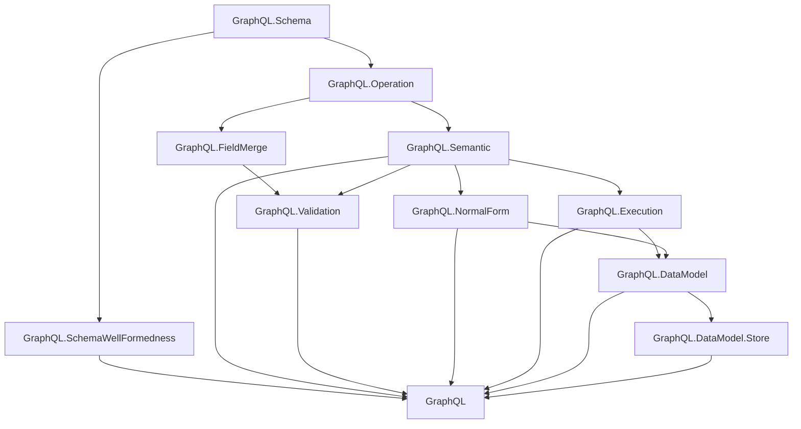

# Project Overview

`graphql-lean` is a Lean formalization workspace for a scoped plain GraphQL
fragment.

Canonical GraphQL specification reference:
[GraphQL September 2025 Edition](https://spec.graphql.org/September2025/).

## Dependency Diagram

## Modules

The plain GraphQL layer is organized under the top-level `GraphQL` library root.

- `GraphQL.Schema`: shared names, type references, input values, constant input
  values, built-in scalars, custom scalars, enums, objects, interfaces, unions,
  input objects, field definitions, argument definitions, lookup helpers,
  possible-object inclusion, constant default-value validation, and output
  subtype checks.
- `GraphQL.SchemaWellFormedness`: schema-level invariants separated from raw
  schema syntax, including unique names, non-empty definition/member lists,
  root query object type, valid type references/defaults, and object/interface
  implementation compatibility.
- `GraphQL.Operation`: operation syntax, field arguments, variable definitions,
  built-in directive applications, selections, named fragment spreads, inline
  fragments, fragments, operation size, fragment-spread collection, and shared
  selection helpers.
- `GraphQL.Semantic`: fragment-inlined operation syntax for semantic analysis.
  It keeps only fields and inline fragments.
- `GraphQL.FieldMerge`: same-response-name field collection and merge
  compatibility, including spec `SameResponseShape`, same field-name/argument
  checks, and recursive subfield merge checks.
- `GraphQL.Validation`: validation as a proposition over a schema and operation,
  including variable definitions/defaults, variable-use compatibility, argument
  checks, recursive input/output type checks, required non-empty selection sets,
  modeled `@skip`/`@include`, field merge checks, fragment resolution,
  acyclicity, and fragment applicability.
- `GraphQL.NormalForm`: ground-typed normal form and non-redundancy predicates over
  semantic selection sets, plus a bounded normalization pass for field merging and
  abstract-type grounding under a directive-free source-operation assumption.
- `GraphQL.Execution`: execution over semantic selections as a function
  parameterized by abstract resolver functions. It collects executable fields by
  response name, resolves each response name once, passes field arguments to
  resolvers, and applies `@skip` / `@include` filtering.
- `GraphQL.DataModel`: an extensional object-store model for the scoped
  conformance target. It represents object identities, field facts keyed by
  already-coerced arguments, unordered GraphQL argument/input-object key
  comparison, store-backed resolvers, and predicates for data-model equivalence
  of semantic operations.
- `GraphQL.DataModel.Store`: store-resolution bridge lemmas connecting
  `Store.resolveValue` results to well-typed schema field facts.

## Flow

The current flow is:

1. `GraphQL.Schema` and `GraphQL.Operation` define raw syntax.
2. `GraphQL.Semantic` inlines named fragments into a field/inline-fragment-only
   selection tree for semantic analysis.
3. `GraphQL.SchemaWellFormedness`, `GraphQL.FieldMerge`, and
   `GraphQL.Validation` state well-formedness and operation validity.
4. `GraphQL.Execution` gives bounded execution over semantic selections by
   collecting fields by response name, then resolving each response name once.
5. `GraphQL.DataModel` constrains execution to a typed object store so semantic
   operation equivalence and ground-normal-form correctness can be stated
   against deterministic data.
6. `GraphQL.NormalForm` provides the normalization proof scaffold.

Normalization consumes the fragment-inlined semantic form and clears retained
fragment definitions from the normalized raw operation. The current normal-form
proof path assumes source operations have no modeled directives, so the
normalizer does not implement directive-sensitive semantics or a directive
erasure pass.

Raw syntax remains permissive. Validation supplies the invariants that later
semantic proofs should rely on.
