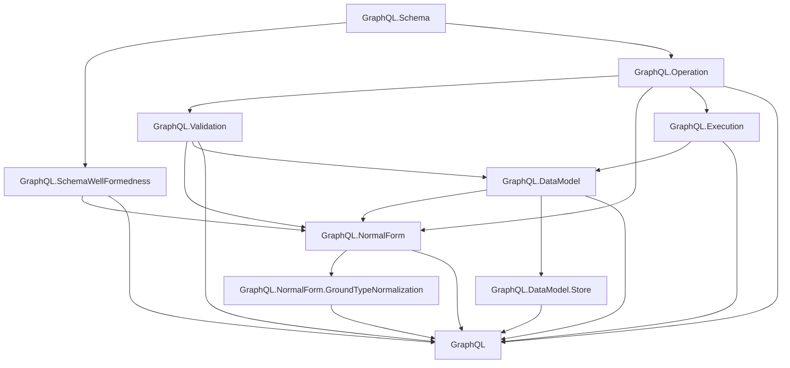

# Project Overview

`graphql-lean` is a Lean formalization workspace for a scoped plain GraphQL
fragment.

Canonical GraphQL specification reference:
[GraphQL September 2025 Edition](https://spec.graphql.org/September2025/).

## Dependency Diagram

## Modules

The plain GraphQL layer is organized under the top-level `GraphQL` library root.

- `GraphQL.Schema`: shared names, type references, input values, constant input
  values, built-in scalars, custom scalars, enums, objects, interfaces, unions,
  input objects, field definitions, argument definitions, lookup helpers,
  possible-object inclusion, constant default-value validation, and output
  subtype checks.
- `GraphQL.SchemaWellFormedness`: schema-level invariants separated from raw
  schema syntax, including unique names, non-empty definition/member lists,
  root query object type, valid type references/defaults, and object/interface
  implementation compatibility.
- `GraphQL.Operation`: operation syntax, field arguments, variable definitions,
  built-in directive applications, selections, inline fragments, operation size,
  and shared selection helpers. Named fragment definitions and fragment spreads
  are intentionally out of scope.
- `GraphQL.Validation`: validation as a proposition over a schema and operation,
  including variable definitions/defaults, variable-use compatibility, argument
  checks, recursive input/output type checks, required non-empty selection sets,
  modeled `@skip`/`@include`, same-response-name field merge checks, and
  inline-fragment applicability.
- `GraphQL.NormalForm`: ground-typed normal form and non-redundancy predicates over
  operation selection sets, a normalization pass for field merging and
  abstract-type grounding, and the public semantic preservation and store-backed
  correctness predicates for directive-free ground-type normalization.
- `GraphQL.NormalForm.GroundTypeNormalization`: proof-facing lemmas for the
  directive-free ground-type normalizer.
- `GraphQL.Execution`: execution over operation selections as a function
  parameterized by abstract resolver functions. It collects executable fields by
  response name, resolves each response name once, passes field arguments to
  resolvers, and applies `@skip` / `@include` filtering. Internal resolver
  values are generic over an `ObjectIdentity` type; final responses do not carry
  object identity.
- `GraphQL.DataModel`: an extensional graph-backed model for the scoped
  conformance target. It represents path-based object identities, node-local
  scalar properties, labeled object edges, unordered GraphQL
  argument/input-object key comparison, graph-root execution, schema-conformant
  field labels, semantic path/key uniqueness, list-index discipline, graph
  well-typedness predicates, store-backed resolvers, and data-model equivalence
  of operations.
- `GraphQL.DataModel.Store`: store-resolution bridge lemmas connecting
  path-based graph lookup and composite-field resolution to schema facts.

## Flow

The current flow is:

1. `GraphQL.Schema` and `GraphQL.Operation` define raw syntax.
2. `GraphQL.SchemaWellFormedness` and `GraphQL.Validation` state
   well-formedness and operation validity.
3. `GraphQL.Execution` gives bounded execution over operation selections by
   collecting fields by response name, then resolving each response name once.
4. `GraphQL.DataModel` describes the typed graph store.
5. `GraphQL.DataModel` constrains execution to store-backed resolvers over that
   graph.
6. `GraphQL.NormalForm` provides normalization definitions and public
   ground-normal-form correctness predicates.
7. `GraphQL.NormalForm.GroundTypeNormalization` provides proof-facing
   ground-type lemmas.

Normalization consumes `GraphQL.Operation` directly. The current normal-form
proof path assumes source operations have no modeled directives, so the
normalizer does not implement directive-sensitive semantics or a directive
erasure pass.

Raw syntax remains permissive. Validation supplies the invariants that later
semantic proofs should rely on.

The completed ground-type normal form correctness proof is summarized in
`docs/ground-type-normal-form-proof.md`.

Lean module organization rules are documented in
`docs/lean-organization.md`.
