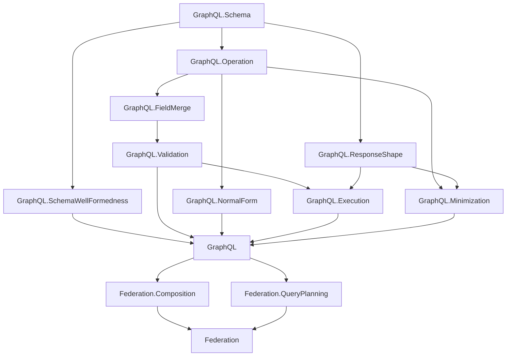

# Project Overview

`graphql-lean` is a Lean formalization workspace for GraphQL and GraphQL federation.

Part 1 models plain GraphQL. Part 2 builds on Part 1 to model federation concepts such as composition and query planning.

Canonical GraphQL specification reference: [GraphQL September 2025 Edition](https://spec.graphql.org/September2025/).

## Dependency Diagram

## Part 1: Plain GraphQL

The plain GraphQL layer is organized under the top-level `GraphQL` library root.

- `GraphQL.Schema`: shared names, type references, input values, built-in scalars, custom scalars, enums, objects, interfaces, unions, input objects, field definitions with output types, argument definitions with input types, field lookup, and possible-object inclusion for abstract types.
- `GraphQL.SchemaWellFormedness`: schema-level invariants separated from raw schema syntax, including unique type/field/argument names, root query object type, valid type references, and object/interface/union consistency.
- `GraphQL.Operation`: operation syntax, field arguments, variable definitions, built-in directive applications, selections, named fragment spreads, inline fragments, fragments, operation size, and shared selection helpers for response names, filtering, and selection-set merging.
- `GraphQL.FieldMerge`: same-response-name field collection and merge compatibility, including response-shape compatibility and recursive subfield merge checks.
- `GraphQL.Validation`: validation as a proposition over a schema and operation, including variable definitions, duplicate argument checks, required argument checks, recursive input/output type checks, non-empty required selection sets, field merge checks, and fragment applicability by possible-object overlap.
- `GraphQL.NormalForm`: ground-typed normal form and non-redundancy predicates plus a bounded normalization pass for field merging and abstract-type grounding.
- `GraphQL.Execution`: execution as a function parameterized by abstract resolver functions, with field arguments passed to resolvers and `@skip` / `@include` filtering for fields, named spreads, and inline spreads.
- `GraphQL.ResponseShape`: response shapes plus shape-to-shape inclusion and equivalence.
- `GraphQL.Minimization`: finite-candidate operation minimization and the minimality theorem shape.

### Plain GraphQL Flow

The current Part 1 flow is:

1. `GraphQL.Schema` and `GraphQL.Operation` define raw syntax.
2. `GraphQL.SchemaWellFormedness`, `GraphQL.FieldMerge`, and `GraphQL.Validation` state well-formedness and operation validity.
3. `GraphQL.Execution` gives bounded execution as a function, parameterized by abstract resolvers.
4. `GraphQL.ResponseShape` defines structural response shapes, shape inclusion, equivalence, and computable boolean checks for inclusion/equivalence.
5. `GraphQL.NormalForm` and `GraphQL.Minimization` provide the normalization/minimization proof scaffolding.

Validation assumptions should be used when proving semantic facts about later stages. Raw syntax remains permissive; validation supplies the invariants that later proofs should rely on.

### Response Shape Model

Response shapes currently distinguish only:

- `scalar`
- `object fields`

This intentionally ignores concrete scalar values, object identities, resolver behavior, nullability, and error propagation. It is the structural shape needed for query equivalence and minimization, not a full response-value model.

`GraphQL.ResponseShape` provides two views of inclusion:

- propositional inclusion, `Shape.includes required available`
- computable inclusion, `Shape.includesBool required available`

The module proves soundness and completeness bridges between those two forms. Equivalence is inclusion in both directions, again with both propositional and boolean APIs.

Shape merging is also structural. When two fields have the same response name, their child shapes are merged recursively. This is intended to match the post-validation field-merge view used by future shape semantics and minimization candidates.

### Concrete Shape Requires Runtime Data

A concrete response shape cannot be derived from only a schema and an operation.

The missing information is the runtime data:

- abstract fields can resolve to different object runtime types,
- inline fragments and fragment spreads are included or skipped based on those runtime object types,
- lists can contain elements with different runtime object types,
- resolver results determine whether child selections are applied to null, an object, or a list of objects.

For that reason, this project currently treats operation-to-shape mapping as abstract in `GraphQL.Minimization`. A later concrete semantics should choose one of these approaches:

- define response shape from executed responses,
- define response shape from an explicit data model and execution relation,
- define a family of possible shapes indexed by runtime object choices,
- define an over-approximation or envelope shape separately from concrete response shape.

### Minimization Plan

The intended minimization proof split is:

The pieces already in place are:

- response-shape inclusion and equivalence, with boolean/propositional bridges,
- a generic finite minimizer theorem over any finite list of equivalent candidates.

The remaining proof ladder is:

1. Choose the concrete shape semantics: executed-response shape, data-model-indexed shape, possible-shape family, or explicit approximation.
2. Strengthen validation around fragments so the chosen semantics can assume fragment references terminate and are well-scoped.
3. Prove normalization preserves the chosen shape semantics.
4. Define a finite candidate generator for fragment-introducing rewrites of a fragment-free operation.
5. Prove generator soundness: every generated operation has the same shape semantics as the input.
6. Prove generator completeness for the chosen normal form, modulo fragment-name alpha-renaming and the operation size metric.
7. Instantiate the generic finite minimizer theorem with that candidate generator.

The normal-form work is the bridge to this proof. Fragment minimization should operate over normalized or canonicalized selection sets so equivalence is tractable.

## Part 2: Federation

Federation starts as a separate top-level Lean library root.

- `Federation.Composition`: composition rules for directives and composite schema constraints.
- `Federation.QueryPlanning`: query planning as constraint solving.

Part 2 should depend on the plain GraphQL semantics and validation core rather than duplicating GraphQL concepts.
