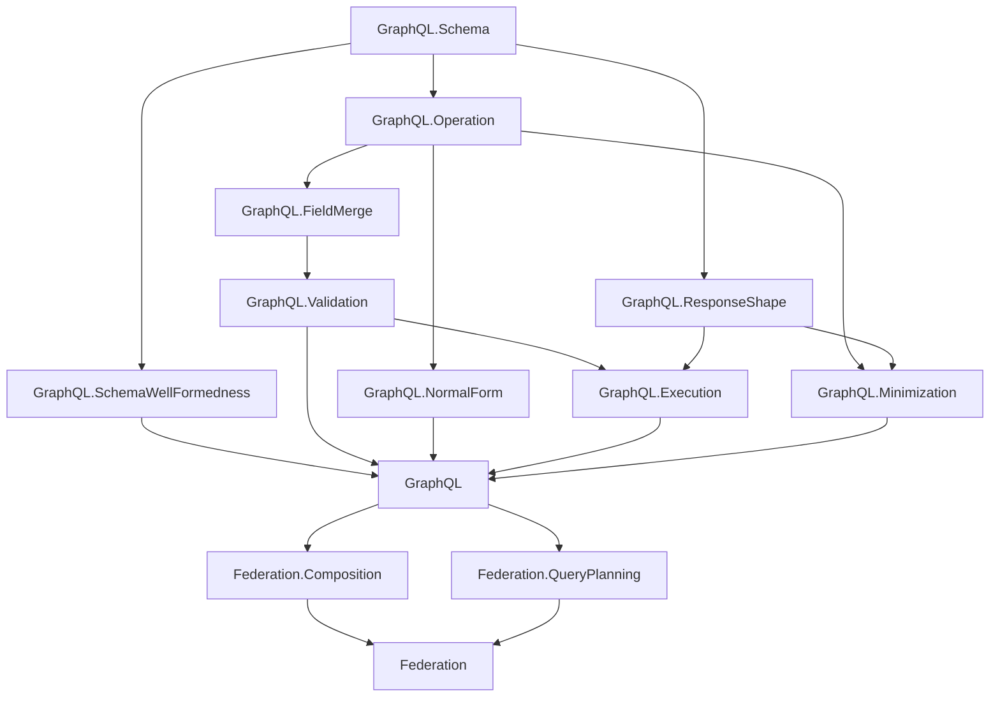

# Project Overview

`graphql-lean` is a Lean formalization workspace for GraphQL and GraphQL federation.

Part 1 models plain GraphQL. Part 2 builds on Part 1 to model federation concepts such as composition and query planning.

Canonical GraphQL specification reference: [GraphQL September 2025 Edition](https://spec.graphql.org/September2025/).

## Dependency Diagram

## Part 1: Plain GraphQL

The plain GraphQL layer is organized under the top-level `GraphQL` library root.

- `GraphQL.Schema`: shared names, type references, input values, built-in scalars, custom scalars, enums, objects, interfaces, unions, input objects, field definitions with output types, argument definitions with input types, field lookup, and possible-object inclusion for abstract types.
- `GraphQL.SchemaWellFormedness`: schema-level invariants separated from raw schema syntax, including unique type/field/argument names, root query object type, valid type references, and object/interface/union consistency.
- `GraphQL.Operation`: operation syntax, field arguments, variable definitions, built-in directive applications, selections, named fragment spreads, inline fragments, fragments, operation size, and shared selection helpers for response names, filtering, and selection-set merging.
- `GraphQL.FieldMerge`: same-response-name field collection and merge compatibility, including response-shape compatibility and recursive subfield merge checks.
- `GraphQL.Validation`: validation as a proposition over a schema and operation, including variable definitions, duplicate argument checks, required argument checks, recursive input/output type checks, non-empty required selection sets, field merge checks, and fragment applicability by possible-object overlap.
- `GraphQL.NormalForm`: ground-typed normal form and non-redundancy predicates plus a bounded normalization pass for field merging and abstract-type grounding.
- `GraphQL.Execution`: execution as a function parameterized by abstract resolver functions, with field arguments passed to resolvers and `@skip` / `@include` filtering for fields, named spreads, and inline spreads.
- `GraphQL.ResponseShape`: response shapes plus shape-to-shape inclusion and equivalence.
- `GraphQL.Minimization`: finite-candidate operation minimization and the minimality theorem shape.

### Minimization Plan

The intended minimization proof split is:

1. Define a finite candidate generator for fragment-introducing rewrites of a fragment-free operation.
2. Prove the generator is sound: every generated operation has the same response shape as the input.
3. Prove the generator is complete: every operation equivalent to the input, up to fragment-name alpha-renaming and the chosen size metric, appears in the candidate set.
4. Use the generic finite minimizer theorem to prove the selected output is minimal.

The normal-form work is the bridge to this proof. Fragment minimization should operate over normalized or canonicalized selection sets so equivalence is tractable.

## Part 2: Federation

Federation starts as a separate top-level Lean library root.

- `Federation.Composition`: composition rules for directives and composite schema constraints.
- `Federation.QueryPlanning`: query planning as constraint solving.

Part 2 should depend on the plain GraphQL semantics and validation core rather than duplicating GraphQL concepts.
