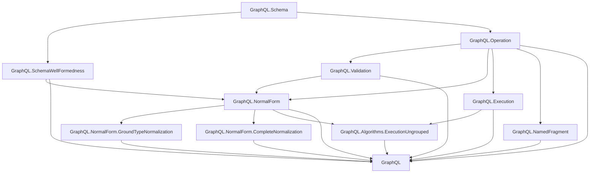

# Project Overview

`graphql-lean` is a Lean formalization workspace for a scoped plain GraphQL
fragment.

Canonical GraphQL specification reference:
[GraphQL September 2025 Edition](https://spec.graphql.org/September2025/).

## Dependency Diagram

## Modules

The plain GraphQL layer is organized under the top-level `GraphQL` library root.

- `GraphQL.Schema`: shared names, type references, input values, constant input
  values, built-in scalars, custom scalars, enums, objects, interfaces, unions,
  input objects, field definitions, argument definitions, lookup helpers,
  possible-object inclusion, constant default-value validation, and output
  subtype checks.
- `GraphQL.SchemaWellFormedness`: schema-level invariants separated from raw
  schema syntax, including unique names, non-empty definition/member lists,
  root query object type, valid type references/defaults, and object/interface
  implementation compatibility.
- `GraphQL.Operation`: operation syntax, field arguments, variable definitions,
  built-in directive applications, selections, inline fragments, operation size,
  and shared selection helpers. Named fragment definitions and fragment spreads
  are intentionally out of scope.
- `GraphQL.Validation`: validation as a proposition over a schema and operation,
  including variable definitions/defaults, variable-use compatibility, argument
  checks, recursive input/output type checks, required non-empty selection sets,
  modeled `@skip`/`@include`, same-response-name field merge checks, and
  inline-fragment applicability.
- `GraphQL.NormalForm`: ground-typed normal form and non-redundancy predicates over
  operation selection sets, a normalization pass for field merging and
  abstract-type grounding, and the public resolver-parametric semantic
  preservation predicates for directive-free ground-type normalization and
  directive-aware complete normalization. Its validity-preservation predicates
  also expose operation-specific assumptions for possible-type validity and
  type-condition feasibility after grounding. The complete-normalization
  validity predicate combines Boolean directive filtering with the
  type-condition feasibility obligation in a BoolCase-indexed assumption.
- `GraphQL.NormalForm.GroundTypeNormalization`: proof-facing lemmas for the
  directive-free ground-type normalizer.
- `GraphQL.NormalForm.CompleteNormalization`: proof-facing lemmas for complete
  normalization, which lifts modeled `@skip`/`@include` behavior into Boolean
  case branches and keeps bottom-branch fields directive-free. Its proof
  modules separate variable/directive facts, BoolCase wrappers, static
  collection, normal-shape facts, operation variables/wrappers, field and
  inline static-collection execution cases, BoolCase runtime selection,
  child completion, scoped resolver bridges, validity preservation for
  Boolean-filtered ground branches, final root semantics, and uniqueness up to
  branch, stem, and sibling reordering.
- `GraphQL.Execution`: fuel-bounded query execution over operation selections,
  parameterized by abstract resolver functions. It
  collects executable fields by response name, resolves each response name
  once, passes field arguments to resolvers, applies `@skip` / `@include`
  filtering, completes values with list/object/non-null null bubbling, and
  returns a response envelope with data plus a `Nat` execution-error count.
  Runtime object values carry their GraphQL object type plus an optional
  resolver-owned opaque object reference; final responses do not carry object
  identity or detailed error metadata. Internal fuel exhaustion is represented
  by `Execution.outOfFuel`, a polymorphic `.error 1`.
- `GraphQL.NamedFragment`: fragment-aware operation syntax, validation,
  direct fragment-aware execution, inlining, translation to the fragment-free
  operation syntax, and proof witnesses connecting fragment-aware validity and
  execution with the inlined fragment-free representation.
- `GraphQL.Algorithms.ExecutionUngrouped`: alternative proof-facing execution
  algorithm that visits selections directly and merges response slices as it
  goes. Its public theorem preserves response data and error presence against
  `GraphQL.Execution`, but not exact execution-error counts.

## Flow

The current flow is:

1. `GraphQL.Schema` and `GraphQL.Operation` define raw syntax.
2. `GraphQL.SchemaWellFormedness` and `GraphQL.Validation` state
   well-formedness and operation validity.
3. `GraphQL.Execution` gives fuel-bounded execution over operation selections
   by collecting fields by response name, resolving each response name once,
   completing values, and accumulating modeled execution-error counts.
4. `GraphQL.NormalForm` provides project-specific normalization definitions and
   public resolver-parametric correctness predicates.
5. `GraphQL.Algorithms.ExecutionUngrouped` provides a verified alternative
   execution algorithm over the same operation syntax.
6. `GraphQL.NamedFragment` provides a fragment-aware proof-facing layer with
   direct named-fragment execution and equivalence/validity bridges through
   inlining and translation to the fragment-free syntax.
7. `GraphQL.NormalForm.GroundTypeNormalization` provides proof-facing
   ground-type lemmas.
8. `GraphQL.NormalForm.CompleteNormalization` provides proof-facing lemmas for
   directive-aware Boolean case branch normalization.

Normal forms consume `GraphQL.Operation` directly. The directive-free
`normalizeOperation` proof path assumes source operations have no modeled
directives. These normal forms are project proof artifacts, not GraphQL spec
features.

Complete normalization is the directive-aware path: it enumerates modeled
Boolean directive variables once at the operation root, creates one
unconditional inline-fragment case branch per complete case, and statically
collects directive-free fields for each ground type under the selected case.
Nested field child normalization receives that case as proof context and does
not introduce another directive-only BoolCase DNF.

Ungrouped execution is a verified algorithmic alternative to `GraphQL.Execution`.
It is documented separately because it is an implementation strategy, not part
of the spec-facing execution definition.

Raw syntax remains permissive. Validation supplies the invariants that later
semantic proofs should rely on.

The normal-form correctness proofs are summarized in `docs/normal-form.md`.
The ground and complete uniqueness arguments are detailed in
`docs/normal-form-uniqueness.md`.
Verified project algorithms are summarized in `docs/algorithms.md`.

Lean module organization rules are documented in
`docs/lean-organization.md`.
